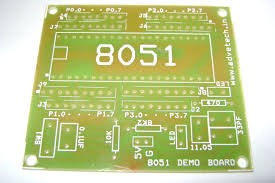
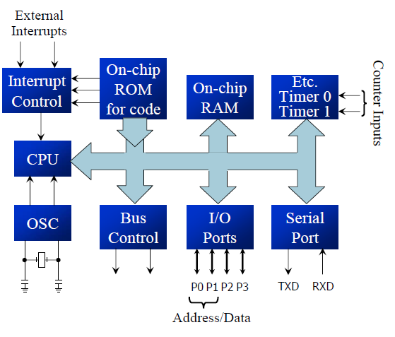
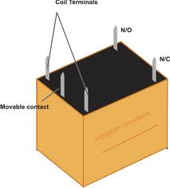
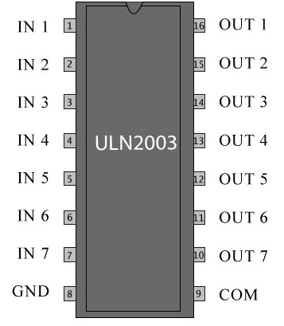
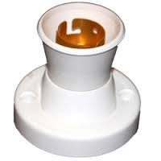

# THEORETICAL ANALYSIS

The hardware components used in the project are studied and analyzed for their prospective usage. The analysis is based on the extent of usage expected from the component in the project.

**2.1 8051 Micro controller based PCB**

**Study:** The microcontroller based PCB is a thin board similar to the breadboard used to mount ICs and other components required to be interfaced with the microcontroller. It has 8051 mounted on it with ports on it needed to interface other components and pin slots to mount other ICs and solder them as per requirements. It has a power supply circuit where all the components required are to be placed on the indicated slots and soldered.

**Figure 2.1 Structure of 8051 based PCB**

**Analysis:** The microcontroller is mounted on a base which is soldered on to the Centre of the PCB with all the peripherals that are to be interfaced are soldered along the designed ports.

**2.2 AT89S51 micro controller**

**Study:** The AT89S51 is a low-power, high-performance CMOS 8-bit microcontroller with 4K bytes of In-System Programmable Flash memory. The device is manufactured using Atmel’s high-density nonvolatile memory technology and is compatible with the industry-standard 80C51 instruction set and pinout. The on-chip Flash allows the program memory to be reprogrammed in-system or by a conventional nonvolatile memory programmer.

Due to a versatile 8-bit CPU with In-System Programmable Flash on a monolithic chip, the Atmel AT89S51 is a powerful microcontroller which provides a highly flexible and cost-effective solution to many embedded control applications.

The AT89S51 is designed with static logic for operation down to zero frequency and supports two software selectable power saving modes. The Idle Mode stops the CPU while allowing the RAM, timer/counters, serial port, and interrupt system to continue functioning. The Power-down mode saves the RAM contents but freezes the oscillator, disabling all other chip functions until the next external interrupt or hardware reset.

The AT89S51 provides the following standard features:

* 4K bytes of Flash
* 128 bytes of RAM
* 32 I/O lines
* Watchdog timer
* two data pointers
* two 16-bit timer/counters
* a five-vector two-level interrupt architecture
* a full duplex serial port
* on-chip oscillator
* Clock circuitry.

**Figure 2.2 Architecture of 8051 family microcontroller**

The study of various modules of 8051 architecture is as follows:

**1. CPU:** The arithmetic and logic unit of 8051 is a 8- bit processor which performs arithmetic and logical operations specified by the code on the data obtained from data memory.

**2. Oscillator Clock:** The heart of the 8051 is the circuitry that generates the clock pulses by which all internal operations are synchronized. Pins XTALI and XTAL2 are provided for connecting a resonant network to form an oscillator. The crystal frequency is the basic internal clock frequency of the microcontroller.

.png>)

**Figure 2.3 Crystal Oscillator**

**3. Bus Control:** Bus is a collection of wires which work as a communication channel or medium for transfer of Data. These buses consists of 8, 16 or more wires. Thus these can carry 8 bits, 16 bits simultaneously. Buses are of two types: Address and Data Bus.

* **Address Bus**: Microcontroller 8051 has a 16 bit address bus. It used to address memory locations. It is used to transfer the address from CPU to Memory.
* **Data Bus**: Microcontroller 8051 has 8 bits data bus. It is used to carry data.

**4. Ports:** 8051 provides 4 parallel ports each 8 bit wide and 1 serial port which can be used to interface any external device directly to it. The ports also provide bit wise connectivity (individual pins can be used separately) so as to separate bit manipulation operations.

**5. Counters/Timers:** Many microcontroller applications require the counting of external events. These tasks keep the processor occupied. To relieve the processor of this burden, two 16-bit up counters, named T0 and T1, are provided for the general use of the programmer. Each counter may be programmed to count internal clock pulses, acting as a timer, or programmed to count external pulses as a counter. These can be used different modes such as 13 bit timers, 8- bit timers, 16 bit timers.

**6. Memory in 8051:** The 8051 has internal RAM and ROM memory for storing code as well as data. Additional memory can be added externally using suitable circuits. The 8051 has a Harvard architecture, which uses the same address, in different memories, for code and data. Internal circuitry accesses the correct memory based upon the nature of the operation in progress.

**Internal ROM:** The 8051 is organized so that data memory and program code memory can be in two entirely different physical memory entities. Each has the same address ranges. The structure of the internal RAM occupies code address space 0000h to FFFFh.

&#x20;The PC is ordinarily used to address program code bytes from addresses 0000h to FFFFh. Program addresses higher than 0FFFh, which exceed the internal ROM capacity, will cause the 8051 to automatically fetch code bytes from external program memory.

**Internal RAM:** The 128- byte internal RAM is organized into three distinct areas.

1\. Thirty-two bytes from address 00h to 1Fh that make up 32 working registers organized as four banks of eight registers each. The four register banks are numbered 0 to 3 and are made up of eight registers named R0 to R 7. Each register can be addressed by name or by its RAM address. Bits RS0 and RS 1 in the PSW determine which bank of registers is currently in use at any time when the program is running. Register banks not selected can be used as general-purpose RAM. Bank 0 is selected upon reset.

.png>)

**Figure 2.4 Memory organization in 8051(RAM)**

2\. A bit-addressable area of 16 bytes occupies RAM byte addresses 20h to 2Fh, forming a total of 128 addressable bits. An addressable bit may be specified by its bit address of 00h to 7Fh, or 8 bits may form any byte address from 20h to 2Fh.

3\. A general-purpose RAM area above the bit area, from 30h to 7Fh, addressable as bytes.

**7.** **Interrupt control:** Interrupts are often the only way in which real-time programming can be done successfully. Interrupts may be generated by internal chip operations or provided by external sources. Any interrupt can cause the 8051 to perform a hardware call to an interrupt-handling subroutine that is located at a predetermined (by the 8051 designers) absolute address in program memory. If the interrupts are generated by a piece of code, they are termed as software interrupts.

The program must be able to inhibit the action of some or all of the interrupts so that crucial operations can be finished. There are priorities sets among competing interrupts that may conceivably occur simultaneously. The IP register bits may be set by the program to assign priorities among the various interrupt sources so that more important interrupts can be serviced first should two or more interrupts occur at the same time.

**Pin description of 8051**

The 8051 is a 40 pin microcontroller with 32 I/O pins and 8 Control pins.

* Power Supply(VCC, Ground)
* Oscillator circuitry(XTAL1 & XTAL2)
* Control pins( ALE, PSEN, E , RESET)
* 32 I/O pins(4 Ports)

**VCC & Gnd:** The Vcc pin is given +5V supply and ground pin is connected to circuit ground. This pin is used to supply power to microcontroller.

**XTAL1 and XTAL2:** These are two I/P line for on-chip oscillator and clock generator circuit. A resonant network as quartz crystal is connected between these two pin. 8051 microcontroller also drives from external clock, then XTAL2 is used to drive 8051 from external clock and XTAL1 should be grounded.

**RESET:** It is active high I/P signal. It should be maintained high for at least two machine cycle while oscillator is running then 8051 microcontroller resets.

**EA (Active Low)/VPP:** It is and active low I/P to 8051 microcontroller. When (EA) = 0, then 8051 microcontroller access from external program memory (ROM) only. When (EA) = 1, then it access internal and external program memories (ROMS).

**PSEN (Active Low):** It is active low O/P signal. It is used to enable external program memory (ROM). When PSEN (Active Low) = 0, then external program memory becomes enabled and microcontroller read content of external memory location. Therefore it is connected to (OE) of external ROM. It is activated twice every external ROM memory cycle.

**ALE:** Address latch enable: It is active high O/P signal. When it goes high, external address latch becomes enabling and lower address of external memory (RAM or ROM) latched into it. Thus it separates A0-A7 address from AD0-AD7. It provides properly timed signal to latch lower byte address. The ALE is activated twice in every machine cycle. If external RAM & ROM is not accessed, then ALE is activated at constant rate of 1/6 oscillator frequency, which can be used as a clock pulses for driving external devices.

**Port 0(P0.0 to P0.7):** It is 8-bit bi-directional I/O port. It is bit/ byte addressable. During external memory access, it functions as multiplexed data and low-order address bus AD0-AD7.

**Port 1 (P1.0 to P1.7):** It is 8-bit bi-directional I/O port. It is bit/ byte addressable. When logic '1' is written into port latch then it works as input mode. It functions as simply I/O port and it does not have any alternative function.

**Port 2 (P2.0 to P2.7):** It is 8-bit bi-directional I/O port. It is bit/ byte addressable. During external memory access it functions as higher order address bus (A8-A15).

**Port 3(P3.0 to P3.7):** It is 8-bit I/O port. In an alternating function each pins can be used as a special function I/O pin. It constitutes serial port in pin 3.0 and pin 3.1

**Analysis**: This microcontroller provides required memory for code and data storage. Along with that sufficient ports exist to interface LCD, Keypad and relays.

.png>)

**Figure 2.5 Pin configuration of 8051**

| **Pin number** | **Symbol** | **I/O**       | **Functionality**                                      |
| -------------- | ---------- | ------------- | ------------------------------------------------------ |
| P3.0           | RxD        | Input Signal  | Receives serial data                                   |
| P3.1           | TxD        | Output Signal | Transmits serial data                                  |
| P3.2           | INT0       | Input Signal  | External Hardware Interrupt                            |
| P3.3           | INT1       | Input Signal  | External Hardware Interrupt                            |
| P3.4           | T0         | Input Signal  | Interfacing external clock to timer 0                  |
| P3.5           | T1         | Input Signal  | Interfacing external clock to timer 1                  |
| P3.6           | WR         | Output Signal | Low Signal=write operation on external memory          |
| P3.7           | RD         | Output Signal | Low signal indicates read operation on external memory |

**Table 2.1 Port 3 Pin Functionality**

**2.3 LCD Display**

**Study:** LCD display is an inevitable part in almost all embedded projects. 16×2 LCD module is a very common type of LCD module that is used in 8051 based embedded projects. It consists of 16 rows and 2 columns of 5×7 or 5×8 LCD dot matrices. The module use here is type number JHD162A which is a very popular one. It is available in a 16 pin package with back light, contrast adjustment function and each dot matrix has 5×8 dot resolution.

The JHD162A has two built in registers namely data register and command register.  Data register is for placing the data to be displayed, and the command register is to place the commands. The 16×2 LCD module has a set of commands each meant for doing a particular job.

.png>)

**Figure 2.6 16 X 2 LCD Display**

**Pin Descriptions:**

**Power Supply:** VEE pin is meant for adjusting the contrast of the LCD display and the contrast can be adjusted by varying the voltage at this pin. This can be done by connecting one end of a POT to the Vcc (5V), other end to the Ground and connecting the center terminal (wiper) of of the POT to the VEE pin.

**Register Select:** High logic at the RS pin will select the data register and Low logic at the RS pin will select the command register. If we make the RS pin high and the put a data in the 8 bit data line (DB0 to DB7), the LCD module will recognize it as a data to be displayed.  If we make RS pin low and put a data on the data line, the module will recognize it as a command.

**R/W:** R/W pin is meant for selecting between read and write modes. High level at this pin enables read mode and low level at this pin enables write mode.

**Enable:** E pin is for enabling the module. A high to low transition at this pin will enable the module.

**Data Pins:** DB0 to DB7 are the data pins. The data to be displayed and the command instructions are placed on these pins.

**Led+ & Led-:** LED+ is the anode of the back light LED and this pin must be connected to Vcc through a suitable series current limiting resistor. LED- is the cathode of the back light LED and this pin must be connected to ground.

**Analysis:** 16X2 LCD Display is used to transfer data that is to be displayed along with a few control lines through 8 data lines. This device is interfaced through a 8 bit parallel port to acknowledge the user about the input provided to the equipment and indicate the validity of data.

**2.4 4 X 4 Matrix Keypad**

**Study:** Hex key pad is a collection of 16 keys arranged in the form of a 4×4 matrix. It has keys representing numeric 0 to 9 and characters A to F. There are 4 rows and columns. There is a switch connecting each row and column. So the combinations of rows and columns makes up the 16 inputs. Initially all the switches are open. When a key is pressed, the switch is closed.

.png>)

**Figure 2.7 Hex Keypad Structure**

The hex keypad has 8 communication lines namely R1, R2, R3, R4, C1, C2, C3 and C4. R1 to R4 represents the four rows and C1 to C4 represents 4 columns. Columns are to be connected to microcontroller as INPUT. The other 4 pins are connected to the microcontroller as OUTPUT. Input port is to be given a high signal and output one, a low signal. When a particular key is pressed the corresponding row and column to which the terminals of the key are connected gets shorted.

The key press can be identified by a method known as column scanning. The microcontroller sends a LOW signal to each row one at a time and check whether there is a LOW signal detected on the column. If there is no button pressed, the microcontroller will scan for the next row and read for LOW signal. Since the column is pulled HIGH internally, no button pressed would return 1 to the microcontroller. When a button is pressed, the row and column are connected. The 0 from row would make the column return a 0 to microcontroller.

**Analysis:** In order to interface a keypad with a microcontroller 2 ports are to be used where horizontal pins are connected to a 4- bit port which is configured as output and vertical pins are connected to another 4 bit input port. This is used to input the id number of required book to the microcontroller.

**2.5 Relays**

**Study: Relay** is an electromagnetic device which is used to isolate two circuits electrically and connect them magnetically. They are very useful devices and allow one circuit to switch another one while they are completely separate. They are often used to interface an electronic circuit (working at a low voltage) to an electrical circuit which works at very high voltage.

**Figure 2.8 12V Relay**

A **relay switch** can be divided into two parts: input and output. The input section has a coil which generates magnetic field when a small voltage from an electronic circuit is applied to it. This voltage is called the operating voltage. The operating voltage of used relay is 12V. The output section consists of contactors which connect or disconnect mechanically.

&#x20;In a basic relay there are three contactors: normally open (NO), normally closed (NC) and common (COM). At no input state, the COM is connected to NC. When the operating voltage is applied the relay coil gets energized and the COM changes contact to NO.

.png>)

**Figure 2.9 Relay Internal Structure**

8051 microcontrollers have an internal pull up of 10KΩ. Hence when a port pin is HIGH the output current flows through this internal pull up resistor. Hence the maximum output current will be  5V/10k = 0.5ma. This current is not sufficient to drive the transistor into saturation and turn ON the relay. So a current drivers such as ULN2003 or ULN 2803 or BC107 are used.

**Analysis:** JQC3FC 5- pin SPDT 12V 5A relays are used to control the bulbs.

**2.6 ULN 2003**

**Study:** ULN2003 is a high voltage and high current Darlington array IC. It contains seven open collector Darlington pairs with common emitters. A Darlington pair is an arrangement of two bipolar transistors.

**Figure 2.10 ULN2003 Pin Description**

ULN2003 belongs to the family of ULN200X series of ICs. Different versions of his family interface to different logic families. ULN2003 is for 5V TTL, CMOS logic devices. These ICs are used when driving a wide range of loads and are used as relay drivers, display drivers, line drivers etc. ULN2003 is also commonly used while driving.

.png>)

**Figure 2.11 ULN2003 Internal Structure Schematic**

The output of the driver is open collector and the collector current rating of each Darlington pair is 500mA. Darlington pairs may be paralleled if higher current is required. The driver IC also consists of a 2.7KΩ base resistor for each Darlington pair. Thus each Darlington pair can be operated directly with TTL or 5V CMOS devices. This driver IC can be used for high voltage applications up to 50V.

**Analysis:** This IC is used to drive seven relays at a time.

**2.7 Transformer**

**Study:** The Voltage Transformer can be thought of as an electrical component rather than an electronic component. A transformer is very simple static (or stationary) electro-magnetic passive electrical device that works on the principle of Faraday’s law of mutual induction by converting electrical energy from one value to another.

.png>)

**Figure 2.12 9V 500mA transformer**

A single phase voltage transformer consists of two electrical coils of wire, one called the “Primary Winding” and another called the “Secondary Winding”. The “primary” side of the transformer is the side that usually takes power, and the “secondary” is the side that usually delivers power.

In a single-phase voltage transformer the primary is usually the side with the higher voltage. These two coils are not in electrical contact with each other but are instead wrapped together around a common closed magnetic iron circuit called the “core”. This soft iron core is made up of individual laminations connected together to reduce the core’s losses. The two coil windings are electrically isolated from each other but are magnetically linked through the common core allowing electrical power to be transferred from one coil to the other.

.png>)

**Figure 2.13 Transformer Internal Structure**

**Analysis:** Micro controller circuitry works on +5 V DC Supply. Thus transformer is used to reduce 230 V to 5V which is suitable for working of 8051 circuitry.

**2.8 Bulbs and Holders**

**Study & Analysis:** 230V 15 W yellow bulbs are used along with holders which are mounted on the racks. They serve as the output devices which indicate the result obtained in a desirable format (glowing).

 

**Figure2.14 Bulb and Holder**
