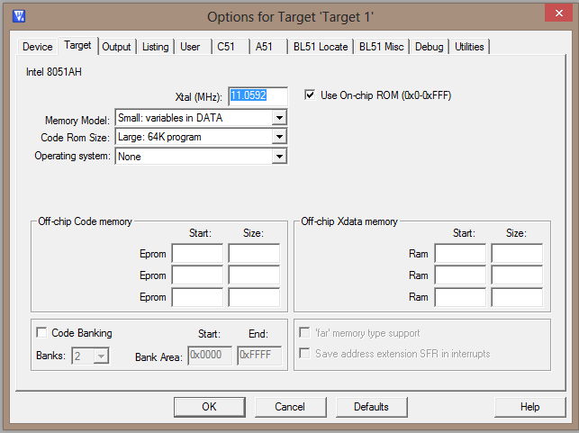
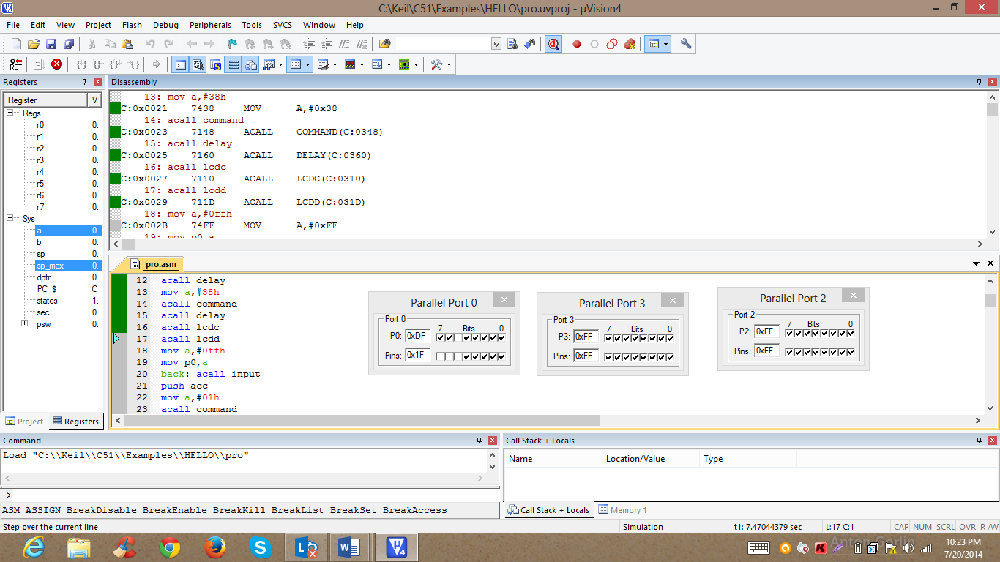

# EXPERIMENTAL INVESTIGATIONS

To develop the application, necessary requirements are analyzed and made available. The process of development is split into three modules. Each module plays a prominent role in the design process. A step by step procedure is formulated in each module and carried on to complete the application design.

1. Software
2. Hardware
3. Dumping and testing

**3.1 Software – Module**

The source code which defines the functionality of the hardware components for effective implementation of the application is designed in this module using a stepwise procedure.

1. **Logic formation:** The book number is input through the keypad. The sum of the digits of all the book number of a certain rack is set unique. Whenever the input is fed to the system, the sum of the digits is taken. The logic is designed in such a way that the assigned sum of digits added with 30 gives the location of storage of control.

| **Storage Location** | **Data stored in the location** | **Binary equivalent of data** |
| -------------------- | ------------------------------- | ----------------------------- |
| 38h                  | 01h                             | 0000 0001                     |
| 39h                  | 02h                             | 0000 0010                     |
| 3ah                  | 04h                             | 0000 0100                     |
| 3bh                  | 08h                             | 0000 1000                     |
| 3ch                  | 10h                             | 0001 0000                     |
| 3dh                  | 20h                             | 0010 0000                     |
| 3eh                  | 40h                             | 0100 0000                     |
| 3fh                  | 80h                             | 1000 0000                     |

**Table 3.1 Logic Database**

Once the control module is started, the data from the memory location is sent to the port containing relays. From the data it is clear that one of the relays will be on at a time which gives the rack number.

**2. Requirement analysis:** Requirement analysis is done in the following fashion. Basing on the hardware architectural analysis, the number of ports to be used are decided. The following is the list of ports and their functionality chosen.

| **Ports**                                           | **Functionality (I/O)** | **Purpose of Usage**                              |
| --------------------------------------------------- | ----------------------- | ------------------------------------------------- |
| 
Port0 (P0.0 – P0.3)

(P0.5, P0.6, P0.7)
 | Output                  | 
Interfacing Keypad(Rows)

LCD control
 |
| Port 1                                              | Output                  | LCD interfacing                                   |
| Port 2                                              | Output                  | Relay interfacing                                 |
| Port 3(P3.0-3.3)                                    | Input                   | Keypad (Columns)                                  |

**Table 3.2 Port Selection**

**3. Module segmentation:** The entire software design is split into segments. Each time there is a necessity for the component the subroutine is called for. After execution of subroutine the necessary task is performed and control is returned to the main code which continues to execute.

*
  *
    *
      *
        1. LCD Segment
        2. Keypad Segment
        3. Main logic

**4. Flowchart developments for segments:** Flowcharts are designed for each segment separately to indicate and help in the design of subroutines.

*
  *
    *
      *
        1. **LCD Segment**
* LCD Display is made to glow first
* Curser is made to blink on the screen
* The text “WELCOME” appears on the screen
* The input is read from keypad and displayed on the LCD
  *
    *
      *
        1. **Keypad segment**
* Initially, the key press is detected
* First rows are checked for key press
* Upon identifying the row, columns are checked
* Key pressed is detected and sent its ANSI value is sent to 8051
  *
    *
      *
        1. **Main Logic**
* Firstly, the book number is input from keypad.
* First digit is added to second digit
* Sum of digits is incremented 30 times
* Data stored in location pointed by result is sent to output

The flowcharts for keypad programming, LCD programming and the entire logic for application in the pictorial format are presented in the later section.

**5. Programming the LCD:** The following are the commands to be given to LCD to initialize it along with their action. These codes are used to operate LCD and are stored in command register. The data is sent to data register and to get it displayed.

| **Code**  | **Operation**                                           | **Port / Pin** |
| --------- | ------------------------------------------------------- | -------------- |
| 0000 0001 | Clear display screen                                    | Port 1         |
| 0000 1110 | Display on, cursor blinking                             | Port 1         |
| 1000 0000 | Force cursor to beginning of 1st line                   | Port1          |
| 0111 1000 | 2 lines and 5 x 7 matrix                                | Port1          |
| 0/1       | 
RS=0(Command register)

RS=1(Data register)
 | P0.5           |
| 0         | R/W=1(Writing Data)                                     | P0.6           |
| 1 0       | E=Set Pulse                                             | P0.7           |

**Table 3.3 LCD Operational Commands**

By giving the above commands, the LCD operation begins and the necessary commands help the LCD to display the data that is sent by the microcontroller. Before sending the input values to display, the LCD displays “WELCOME” before every request for application.

**6. Programming the keypad:** Matrix keypads use a combination of four rows and four columns to provide button states to the host a micro-controller. Underneath each key is a push button, with one end connected to one row, and the other end connected to one column.

In order for the micro controller to determine which button is pressed, it first needs to pull each of the four columns either low or high one at a time, and then poll the states of the four rows. Depending on the states of the rows, the micro controller can tell which button is pressed. The process proceeds like this:

* Columns are grounded initially
* Each and every row is checked for key press
* Upon row detection, each and every column is checked for key press
* Knowing row and column the position of key press is identified
* The ANSII value of the key pressed is fed to microcontroller

**7. Programming relays:** The relays are programmed in such a way that only one bulb glows at a time. . The sum of digits of book numbers in a particular rack is defined and maintained constant. All the other relays are given zero and only the desired relay is given one as per the data in the location specified by the sum of digits added with 30.

**8. Coding with Keil software:** Keil µ vision4 for the 8051 Microcontroller Architecture support every level of software developer from the professional applications engineer to the student just learning about embedded software development.

The Keil µVision Debugger accurately simulates on-chip peripherals (CAN, UART, SPI, Interrupts, I/O Ports, A/D Converter, D/A Converter, and PWM Modules) of 8051 device. Simulation helps in understanding hardware configurations and avoids time wastage on setup problems.

Additionally, with simulation, writing and testing applications can be done before target hardware is available. This makes Keil more adaptable to programming. So the code is written and developed as follows:

**Step 1) Starting a new project:** New project is started by opening Keil µ vision4 and then clicking on the project tab. Then new µ vision4 project option is to be selected.

.png>)

**Figure 3.1 starting a new project**

**Step 2) Choosing microcontroller:** The desired micro controller AT89C51 of Atmel is chosen from the list of microcontrollers.

.png>)

**Figure 3.2 choosing microcontroller**

**Step 3) Setting the target:** certain options are to be set to the target file to get the code simulated on a virtual platform.

.png>)

**Figure 3.3 options for target**

**Step 4) Setting master oscillator frequency:** The master oscillator frequency is set to be 11.0592 MHz from defined 12 MHz in the target properties’ selection so as to achieve the exact conditions of 8051.

**Figure 3.4 setting frequency**

**Step 5) Editing the program:** The program is edited using the text editor. If the code is written in assembly language, the file is to be stored with .asm extension, else if the code is written in embedded C language, the source file is to be stored with .c extension. The file stored will be the source file that is to assign the functions of microcontroller.

**Step 6) Segment linking:** The segments are coded separately in parts and then all are to be put together as per the planning to have a smooth flow of control from one segment to another. The file is then saved again after making all the necessary changes in the code are applied

**Step 7) Adding source file to target:** The source file which is a text file with an .asm or .c extension is to be added to the project so as to get the code compiled and simulated (debugged and tested).

.png>)

**Figure 3.5 Adding source file to target**

**Step 8) Organizing segments:** All the segments are organized in a systematic manner. The flow of control from one module to another module is depicted in a systematic fashion in the table along with the procedure executed and the result that is obtained after the fruitful execution of the defined segment. The keypad and LCD segments are called twice and thrice respectfully.

| **Step** | **Segment**  | **Operation**                                    | **Result**                        |
| -------- | ------------ | ------------------------------------------------ | --------------------------------- |
| 1        | Main program | Called for LCD                                   |                                   |
| 2        | LCD          | LCD operation starts                             | “WELCOME” is displayed            |
| 3        | Main program | Called for input                                 | Keypad segment called             |
| 4        | Keypad       | Key press is detected and identified             | ASCII value of key is returned    |
| 5        | Main program | Value to be displayed on LCD                     | LCD segment called                |
| 5        | LCD          | Called LCD segment                               | Value of key pressed is displayed |
| 6        | Main program | Called for second input                          | Keypad segment called             |
| 7        | Keypad       | Key press is detected and identified             | ASCII value of key is returned    |
| 8        | Main program | Value to be displayed on LCD                     | LCD segment called                |
| 9        | LCD          | Called LCD segment                               | Value of key pressed is displayed |
| 10       | Main program | Both inputs added                                | Sum is stored in accumulator      |
| 11       | Main program | Sum added with 30                                | Number stored in accumulator      |
| 12       | Main program | Data in value of accumulator sent to relays      | Relay switching takes place       |
| 13       | Main program | Microcontroller sets to the beginning of program | Keypad status checked             |

**Table 3. 4 Organization of segments**

**9. Compiling the code:** The code is then compiled, where the library files are linked to the program and object file is generated. This file is then checked for errors. Any errors present are indicated which can be rectified and the program is compiled again till it is error free. Once the code is error free, it can be sent for debugging.

.png>)

**Figure 3.6 Compiling of code**

**10. Debugging and testing:** After compiling and code and ascertaining it to be error free, the code is then debugged. The code is run on a virtual platform with the test inputs fed and the output is observed through the peripherals provided by keil software.

**Figure 3.7 Debugging of code**

**3.2 Hardware – Module**

A sequence of steps comprising of hardware assembly of the kit is adopted to accomplish this module. In this process, each and every component is tested and interfaced with the microcontroller AT89S51.

**1. Examining 8051 based PCB’s connections:** The PCB slots is examined and checked for connections of power supply. The port slots are checked to have proper connections.

**2. Testing LCD, relays, bulbs and ULN2003:** Once the PCB is checked the components are checked one by one.

**LCD:**

* The Vcc pin and Gnd are connected to +5V and ground respectively
* Vee pin is grounded
* Led+ is given +5V and Led- is given to ground.
* Display Brightness is checked using pot between Vee and Vcc

**Relays:**

* The multimeter is kept in the continuity check mode.
* The continuity between the N/C contacts and pole is checked
* Discontinuity between N/O contacts and the pole is checked
* The relay is energized and checking process is repeated.

**Bulbs:**

* The bulbs are connected to a holder
* The phase wire is given to cable’s phase wire
* The ground wire is given to ground of cable wire

**ULN2003:**

* Vcc is given +5V and Gnd pin is grounded
* Inputs are given and outputs are checked

**3. Power supply Circuitry:** The microcontroller circuitry works on a supply of 5-9V. So 230V A.C supply is transformed to 12V DC using the following circuit:

.png>)

**Figure 3.8 Schematic of Power Supply Circuit**

**4. Soldering microcontroller’s base onto specified slot:** The microcontroller is to be mounted on a base since the direct soldering of IC onto the PCB might damage it due to poor heat resistivity. The base also has 40 pins which are soldered into the respective slots provided for the IC. After giving supply the difference of voltage between Vcc and Ground is checked to ascertain 5 V.

**5. Preparation of relay board:** All the relays are soldered onto a PCB with all the first pins commonly connected to 12V supply. Simultaneously all the second pins are shorted. The IC ULN2003 is used to drive the current necessary for functioning of relays.

| **Pins of relays** | **Positioning in Architecture** | **Functional Usage**      |
| ------------------ | ------------------------------- | ------------------------- |
| Pin 1              | 12V supply                      | Supply to relay           |
| Pin 2              | 230V supply                     | Supply to bulbs           |
| Pin 3              | ULN2003 output                  | Switching action of bulbs |
| Pin 4              | No connection                   |                           |
| Pin 5              | Bulbs                           | Contact to bulbs          |

**Table 3.5 Relay Connections**

**6. Connecting keypad:** The keypad’s 4 rows pins are connected to port 0 and 4 columns are connected to port 1 which are configured as output and input respectively.

**7. Connecting LCD:** LCD is connected by soldering its 16 pins onto the 8051 PCB.

| **Pin number** | **Position in architecture** | **Function**                                                               |
| -------------- | ---------------------------- | -------------------------------------------------------------------------- |
| 1              | Ground                       | Ground                                                                     |
| 2              | Vcc(+5 Volts)                | +5V Power Supply                                                           |
| 3              | Ground via resistor pot      | Power supply to control contrast                                           |
| 4              | P0.5                         | 
RS=0 to select command register,

RS=1 to select data register
 |
|  5             | P0.6                         | 
R/W=0 for Write

R/W=1 for read
                                |
| 6              | P0.7                         | Enable                                                                     |
| 7-14           | P1.0-P1.7                    | 8-Bit Data bus                                                             |
| 15             | Vcc(+5V)                     |                                                                            |
| 16             | Ground                       |                                                                            |

**Table 3.6 LCD Connections**

**8. Preparing bulbs and holders to be attached to relays:** Bulbs are to be given 230V supply. Since all the bulbs do not glow simultaneously the supply is given to relays and the output of relays is given to bulbs. The neutral of one bulb is connected to the other and the final neutral is given to that of cable. The phase wire of the power cable is fed to the second pins of all relays in common.

**9. Connecting bulb holders to relays:** The phase terminal of each bulb is given to a relay’s second terminal and their neutral terminals are all shorted.

**10. Connecting relays to microcontroller:** The relays are connected to the output pins of a ULN2003. The output from microcontroller is given to input pins of ULN driver.

&#x20;Upon setting up the entire kit the code is then inscribed onto the microcontroller. This is done through the process of dumping.

**3.3 Dumping Module**

The code written in the first module should be dumped onto the microcontroller to guide it throughout the process and get the work done by desired work done. This is done using a Flash programmer. The process of dumping proceeds as follows:

* Initially the Power on the board which is to be programmed is switched off.
* The serial cable from the system (pc) is connected into the serial connector on the Board which is to be programmed.
* Afterwards the power to the Board which is to be programmed is turned on
* Now Flash Magic is started by clicking the button which is already installed in the pc using the disc provided along with the programmer.
* Once the Flash Magic is started, a Flash Magic tool of version (3.35.167) which is developed for NXP Semiconductors appears on the screen.
* The Microcontroller needs to be set up, using SET the COM port to the serial port connected to the board which is to be programmed.
* Afterwards the baud rate is set to 9600.
* Device is Configured (P89V51RD2) and ISP (In-system programming) is to be selected as an interface.
* Then the hex code of the program is selected for dumping onto the Board.
* Clicking the start tab puts the code onto the microcontroller
