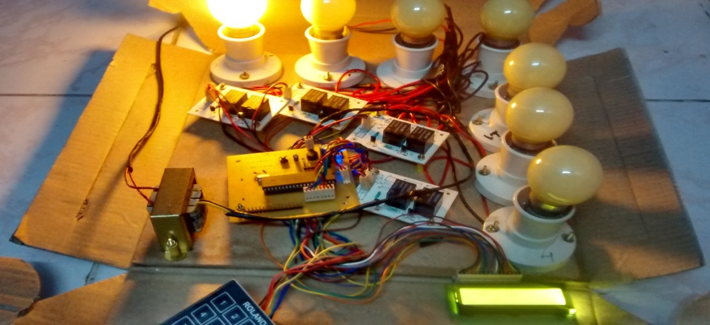
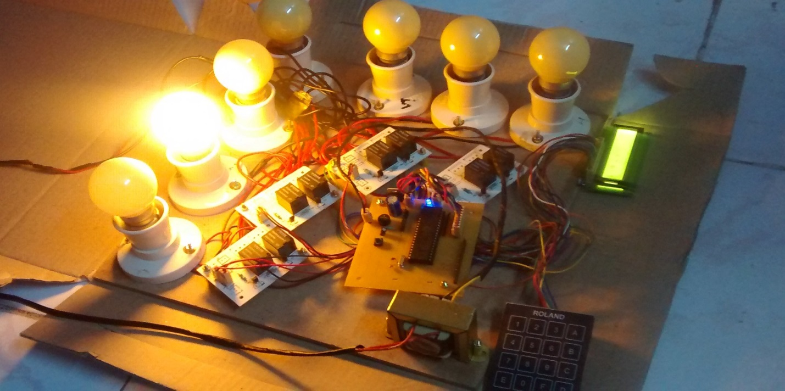

# EXPERIMENTAL RESULTS

Upon assembling the hardware components the kit was checked for proper connections and proceeded on to testing with several test inputs after packing.

.png>)

**Figure 4.1 Snapshot of Kit**

Before testing, the entire kit was packed in a cardboard box arranging the bulbs linearly as per their rack wise order. The relay board and the controller board are fixed or attached to proper slots by fixing LCD and keypad at a convenient position.

**Figure 4.2 Snapshot of Kit After packing**

The kit obtained upon following the hardware and software design procedures is tested by giving a set of inputs.

| **Rack 1** | **Rack 2** | **Rack 3** | **Rack 4** | **Rack 5** | **Rack 6** | **Rack 7** |
| ---------- | ---------- | ---------- | ---------- | ---------- | ---------- | ---------- |
| 19         | 29         | 39         | 49         | 59         | 69         | 79         |
| 28         | 38         | 48         | 58         | 68         | 78         | 88         |
| 37         | 47         | 57         | 67         | 77         | 87         | 97         |
| 46         | 56         | 66         | 76         | 86         | 96         |            |
| 55         | 65         | 75         | 85         | 95         |            |            |
| 64         | 74         | 84         | 94         |            |            |            |
| 73         | 83         | 93         |            |            |            |            |
| 82         | 92         |            |            |            |            |            |
| 91         |            |            |            |            |            |            |

**Table 4.1 Set of valid Inputs and observed Outputs**

The bulbs corresponding to each rack glow whenever a proper input is given. If the input is one of the listed set in column 1 of the above table, the bulb corresponding to rack 1 glows. Similarly the other bulbs glow when the input from the respective column is given.

**Figure 4.3 Snapshot Demonstrating the working of Kit**
