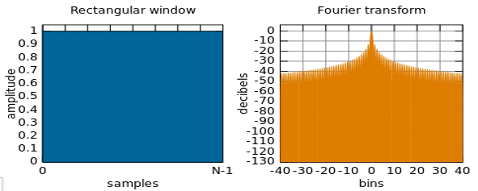
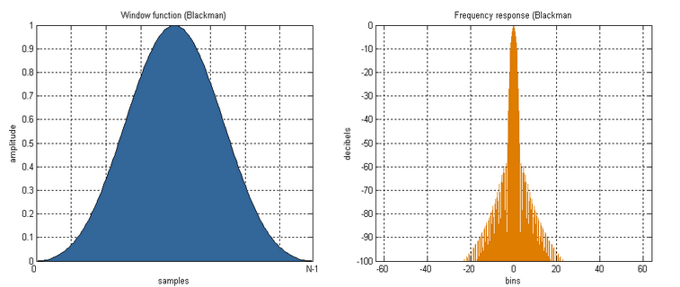
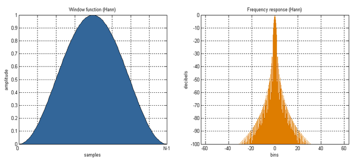

# INTRODUCTION TO FILTERS

&#x20;Filters form the essential building blocks of any Digital signal processing circuit. They are used to select the desired component out of the existing signal by filtering out the unwanted components.

**2.1 Types of Filters:** There are several kinds of filters based on the type of their impulse response, the inputs they process and the filtration range of system, the frequency response of the system etc.,

**Figure 2.1 Classification of Filters**

1. Based on the Input Signals
   1. Analog Filters
   2. Discrete Time Filters
   3. Digital Filters
2. Based on Frequency Response
   1. Low Pass Filter
   2. High Pass Filter
   3. Band Pass Filter
   4. Band Elimination Filter
3. Based on Impulse Responses
   1. Finite Impulse Response
   2. Infinite Impulse Response

**2.1.1 Based on the Input Signals**

a) **Analog Filters:** These filters take analog signals as input and processes them. These filters can be designed by Butterworth, Chebychev Filters etc. These filters differ in the pass band attenuation, stop band frequency pass band frequency, transition bandwidth and other parameters.

b) **Discrete Time Filters:** Working with the sampled versions of analog signals is dealt by this kind of filters. These filters work in a similar fashion to that of analog filters but process on discrete sample values instead of continuous signals.

c) **Digital Filters:** These filters feed on digital signals and deliver out digital signals. They form the essential components for any Digital Signal Processor to filter out the noise. They take the aid of Analog to digital convertors to interact and communicate with the external world (analog signals).

**2.1.2 Based on Frequency Response**

a) **Low Pass Filter**

The filters which allow low frequency components of a signal is called a low pass filter. It eliminates all the frequencies above a frequency called the cut off frequency.

b) **High Pass Filter**

The filters which allow high frequency components of a signal is called a low pass filter. It eliminates all the frequencies below a frequency called the cut off frequency.

.png>)

**Figure 2.2 Characteristics of Filters**

c) **Band Pass Filter**

This filter allows only a desired range of frequencies to pass through it and opposes the signals at other frequencies. There exists two cut off frequencies which specify the pass band frequency range.

d) **Band Elimination Filter**

This filter allows only a desired range of frequencies to pass through it and opposes the signals at other frequencies. There exists two cut off frequencies which specify the pass band frequency range.

**2.1.3 Based on Impulse Response**

a) **Finite Impulse Response:** The output y of a linear time invariant system is determined by [convolving](http://en.wikipedia.org/wiki/Convolution) its input signal x with its [impulse response](http://en.wikipedia.org/wiki/Impulse\_response) b. For a [discrete-time](http://en.wikipedia.org/wiki/Discrete-time) FIR filter, the output is a weighted sum of the current and a finite number of previous values of the input.

An FIR system does not have feedback. Hence the past outputs term y (n-k) will be absent in equation. Hence output of FIR system is given as,

.png>)

If there are ‘M’ coefficients, then above equation becomes,

.png>)

Note that we are considering equation for ‘M’ coefficients for simplicity. It does not change the meaning of the equation. Taking z-transform of above equation we get,

.png>)

Hence the system function .png>)

.png>)

This is the system function of FIR system. Taking inverse z-transform of above equation we get unit sample response of the FIR system

.png>)

b) **Infinite Impulse Response:** The [impulse response](http://en.wikipedia.org/wiki/Impulse\_response) h (n) can be calculated if x (n) = δ (n) in the above relation, where δ\[n] is the [Kronecker delta](http://en.wikipedia.org/wiki/Kronecker\_delta) impulse. The impulse response for an FIR filter then becomes the set of coefficients bn, as

h

\= bn for n=0 to N

The [Z-transform](http://en.wikipedia.org/wiki/Z-transform) of the impulse response yields the [transfer function](http://en.wikipedia.org/wiki/Transfer\_function) of the FIR filter

H(z) = Z{h\[n]}

\= z-n

&#x20;\=

FIR filters are clearly bounded-input bounded-output (BIBO) stable, since the output is a sum of a finite number of finite multiples of the input values, so can be no greater than ∑|bi| times the largest value appearing in the input.

**2.2 Filter Design**

To design a filter the coefficients are to be computed such that the system has specific characteristics which meet the filter specifications which are depicted in the frequency response of filter. There are different methods to find the coefficients from frequency specifications.

Some of the methods are listed below:

1. Window design method
2. Frequency Sampling method
3. Parks-McClellan method (also known as the Equiripple, Optimal, or Minimax method).

**2.2.1 Window design method**

The computation of filter coefficients can be done simply by window method where the impulse response is limited to finite number of samples determined by the size of the window.

**Windows:** These are structures with well-defined parameters like pass band attenuation, stop band attenuation, cut off frequency, transition bandwidth, and pass band frequency. They are used to multiply with the impulse response to restrict its length.

**Design of linear phase FIR Filters using window:**

Let the digital filter which is to be designed have the frequency response Hd(). This is also called desired frequency response. Let the corresponding unit sample response be hd(n). Hd() is the fourier transform of hd(n). hd(n) can be obtained by taking inverse Fourier transform of Hd().

.png>)

The procedure to be followed to obtain Filter coefficients using Windows Method is as follows:

1. The desired unit sample response is obtained from desired frequency response by the above equation.
2. The unit sample response obtained by above equation is infinite in duration
3. For designing a finite impulse response filter, the length of hd (n) should be made finite.
4. hd(n) is truncated to desired length ‘M’ by multiplying hd(n) by a window sequence (n).
5. The selection of window is done basing on the existing requirement and characteristics of windows.

**Desirable characteristics of windows**

1. A window must be symmetric about its center so that linear phase filters can be designed.
2. In the spectrum of the window, the side lobes should be as small as possible.
3. A window must be of finite length.
4. The attenuation characteristics of the window depends upon its shape.
5. The width of the main lobe and amplitudes of side lobes must be controllable.
6. The shape of the window should suit the particular input data so that spectral leakage is minimum.

**Different Types of windows**

Window functions frequently used for filter design to confine infinite impulse response to a finite length are as follows.

**Rectangular window:** The rectangular window of length ‘M’ is given as,

.png>)

Now let us consider the Fourier transform of rectangular window. It can be obtained as

.png>)

**Figure 2.3 Rectangular Window – Time and Frequency Domain**

**Bartlett (Triangular) window:** Bartlett window is also called triangular window. It is expressed mathematically as

Fourier transform of this window can be obtained on same lines as discussed for rectangular window. This Fourier transform gives the frequency response of the window.

.png>)

**Figure 2.4 Barlett Window – Time and Frequency Domain**

**Blackmann window:** The Blackmann window has a bell like shape of its time domain samples. It is expressed mathematically as,

**Figure 2.5 Blackman Window – Time and Frequency Domain**

The above figure shows its magnitude response. Observe that the width of the main lobe is increased. But it has very small side lobes.

**Hamming window:** Hamming window is most commonly used window in speech processing. It is given as,

This window also has bell like shape, its first and last samples are not zero. The sketch of Hamming window, its magnitude response depicts the fact that it has reduced side lobes but slightly increased main lobe. The side lobes are higher than Blackmann window. This is the most commonly used window due to resemblance of frequency response with Sinc function which is the frequency response of Gate function or Pulse.

.png>)

**Figure 2.6 Hamming Window – Time and Frequency Domain**

**Hanning window:** Hanning window has shape similar to those of Blackmann and Hamming. Its first and last samples are zero. It is given as,

Figure shows the sketch of this window along with magnitude response of Hanning window. This window is commonly used for spectrum analysis, significant and music processing. Observe that it has narrow main lobe, but first few side lobes are significant. Then side lobe reduce rapidly.

**Figure 2.7 Hanning Window – Time and Frequency Domain**

**2.2.2 Frequency Sampling Method**

Let the desired frequency response of FIR Digital Filter be Hd (). This frequency response is sampled uniformly at ‘M’ points. These frequency samples are given at discrete intervals of k.

.png>)

This sampled desired frequency response is discrete Fourier transform. It can be denoted as H (k) such that

H (k) = Hd ()|=k

\= Hd () 

Thus H (k) is an M point DFT. By taking inverse discrete Fourier transform (IDFT) of H (k), we get h (n) which is the unit impulse response of FIR Digital Filter as

.png>)

Thus the unit impulse response of FIR Filter of length ‘M’ is obtained using frequency sampling technique. For the FIR Filter to be realizable, the coefficients h (n) should be all real. This is possible if all complex terms appear in complex conjugate pairs. The term H (M-k)

Here .png>) always.

This implies .png>)

Due to linearity in phase the coefficients are symmetric in nature. This means |H(M-k)|=|H(k)|. Thus it can be observed that H (M-k)=H(k) =H\*(k)

&#x20;Thus the impulse response h (n) is expressed as

**2.2.3 Parks-McClellan method**&#x20;

It is also called as optimal method or Equi Ripple Method or Maximal Method. The Remez exchange algorithm is commonly used to find an optimal equi ripple set of coefficients. Here the user specifies desired frequency response, a weighting function for errors from this response, and a filter order N. The algorithm then finds the set of (N + 1) coefficients that minimize the maximum deviation from the ideal.

&#x20;Intuitively, this finds the filter that is closer to the desired response when only  (N + 1) coefficients are to be used. This method is particularly easy in practice since at least one text includes a program that takes the desired filter and N, and returns the optimum coefficients.
