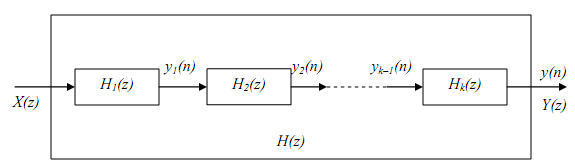
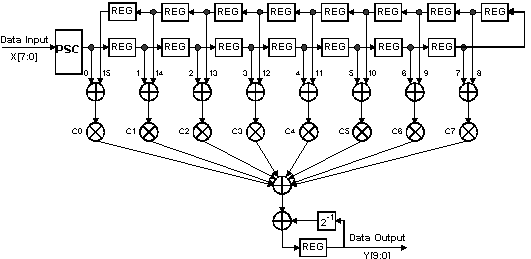

# FIR DIGITAL FILTER STRUCTURES

**3.1 Elementary Blocks for Filter Realization**

In time domain, FIR Digital Filter system is realized by implementing the following equation .png>)

This equation can be represented in a number of ways with the help of delay elements, multiplies and adders as elementary blocks. These blocks are synthesized using various approaches which are dependent on the software platform used to realize these blocks.

**Table 3.1 Summary of elementary blocks used in FIR Digital Filter**

| **Elements** | **Block Diagram**                   | **Signal Flow**                     |
| ------------ | ----------------------------------- | ----------------------------------- |
| Adder        | .png>) | .png>) |
| Time Delay   | .png>) | .png>) |
| Multiplier   | .png>) | .png>) |

These software implemented blocks are implanted or dumped onto hardware equipment directly after verification and can fruitfully be operated.

**3.2 Need for Different Structures of Realization**

There are different types of realization structures, which are obtained by rearranging the above equation in different formats. A single equation is broken into small equations and simplified structures are prepared. These small structures are then inter connected to achieve overall system realization. Various structures of realization possible are as follows:

1. Direct structure
2. Cascade structure
3. Frequency sampling structure

These structures effect the important parameters of the system such as computational complexity, memory requirements, finite word length effects etc. These effects result due to quantization and rounding / truncation operation which are performed on data since digital systems have finite word length.

**3.3 Basic Fir Filter Structures**

An FIR system does not have feedback. Hence the impulse response of a FIR digital filter comprises of weighted samples of only the present and past inputs.

.png>)

&#x20;The transfer function of this filter can be obtained by representing in frequency domain using Z – transform. The system function is

.png>)

&#x20;The transfer function is obtained as

.png>)

The unit sample response of FIR digital filter can be obtained by taking the inverse Z- transform as

**Direct structure**

This form of realization structure is obtained by implementing the basic or natural form of impulse response equation directly. Since h (n) = bn, the expression for filtered output is given as .png>)

This expression can be implemented by implementing the individual terms of above equation using elements like delays, adders and multipliers.

.png>)

**Figure 3.1 Direct Form of realization**

Each module is designed by feeding input to a delay followed by multiplier. The output is fed to final stage adder.

**Cascade structure**

The system function of the fir system is given by the equation below:

This is a polynomial in z-1. This polynomial can be arranged as multiplication of multiple second order polynomials i.e.

.png>)

Where, .png>)

Thus Hk (z) are second order systems. Normally complex conjugate roots of H (z) are combined together in each second order section. Hence the coefficients {bki} are real valued. We know that.png>), then equation can be written as, 

.png>)

Taking inverse z-transform of above equation,

.png>)

&#x20;The above realization can be directly obtained from equation also. There is no need to derive the equation. As the second order system function of equation has the coefficient of z-1 as bk1, it will be multiplied to one unit delayed input. Similarly the coefficient bk2 has multiplier of z-2. Hence it will be multiplied to the input which is delayed by two units. Clearly we get the same realization.

**Figure 3.2 Cascade from of Realization**

&#x20;We know that when system functions are multiplied, it is cascading of actual systems. The system function H (z) is multiplication of second order system function as given by the equation. Hence the realization of the discrete time system can be obtained by cascading these second sections as shown in the figure.

&#x20;Each H1 (z), H2 (z) etc. in above figure is a second order section, and it is realized by the direct form as shown in the figure. The output of one section becomes input of next system.

**Frequency Sampling Structure**

&#x20;The operation of the FIR filter is desired at some frequencies only. The frequency sampling realization takes the advantage of this fact.

&#x20;The FIR system is realized only at the frequencies of interest. This reduces the complexity of the system. Let the frequencies of interest be spaced uniformly.

.png>)

&#x20;Here .png>) is the frequency at discrete points of interest. Let the unit sample response of FIR system by h (n). Then the Fourier transform of h (n) gives system transfer function. It is denoted by H ().

From the Fourier transforms,

.png>)

H (k) is also written as H (k). Hence the above equation can be written as,

The above equation represents M-point DFT of h (n). Thus h (n) is obtained by inverse DFT as,

Z-transform of h(n) can be obtained as,

.png>)

Putting value of h(n) from equation

.png>)

Interchanging the order of summations in the above equation,

.png>)

Upon reducing the above expression, we have

The above equation can be considered as multiplication of two systems with transfer functions.

&#x20;Here H1 (z), and H2 (z) can be realized independently. H (z) can be implemented by cascading these two modules. This kind of realization is employed for large structures where each module can be realized independently and grouped for realization of entire system.

**Fig 3.3 Frequency Sampling Structure**
