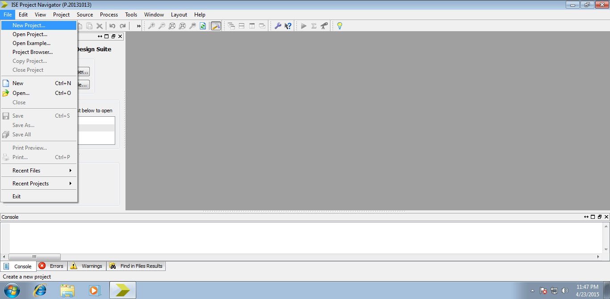
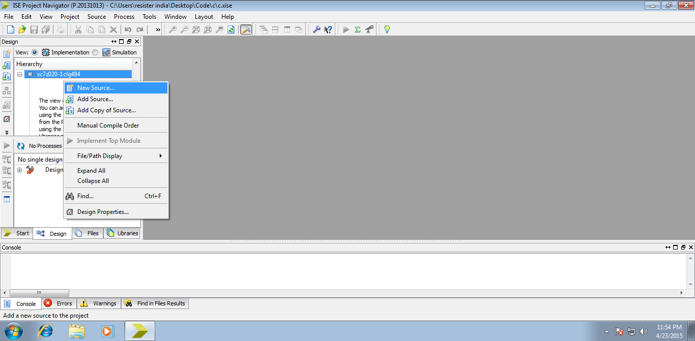
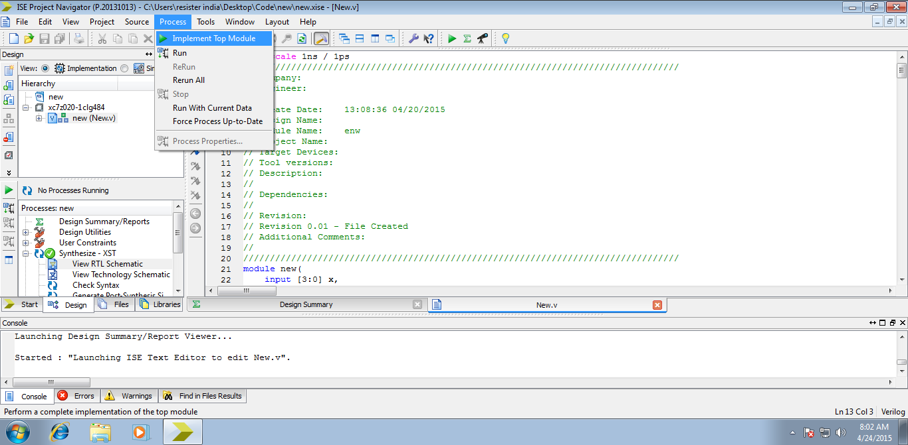
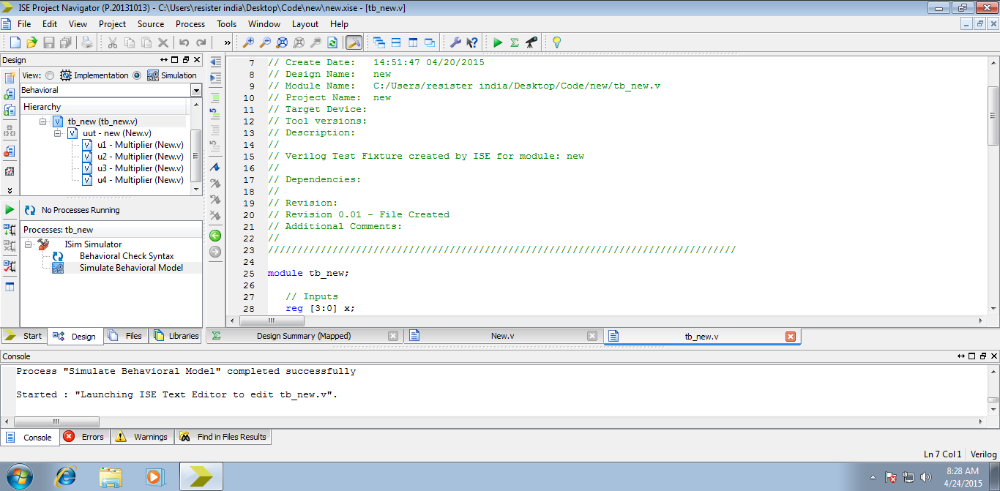

# EXPERIMENTAL INVESTIGATIONS

To implement the FIR Filter module, necessary requirements are analyzed and made available. The process of implementation is split into three stages. Each stage plays a prominent role in the design process. A step by step procedure is formulated at each stage and carried on to complete the filter design. The following are the stages that play a crucial role in Filter implementation.

1. Logic analysis
2. Tool analysis
3. Coding of Filter

**5.1 Logic Analysis**

The flow control strategies which defines the functionality of the filter’s effective implementation are designed in this module using a stepwise procedure. The design specifications are generated from requirements. Algorithms are then formed to realize specifications using ISE design tools.

**5.1.1 Design of Specifications**

Digital data is fed as input to the filter. The design is done for four bit input. The order of the filter is considered as 4. All the four coefficients of filter are generated by using any filter design method. Their multiplication charts or product values are stored in corresponding LUTs of their multipliers. The width of inputs and outputs are specified as 4 and 9 bits respectively.

**5.1.2. Module segmentation:**

&#x20;The entire software design is split into segments. Each time there is a necessity for the component the subroutine is called for. After execution of subroutine the necessary task is performed and control is returned to the main code which continues to execute.

*
  *
    *
      *
        1. Multiplier
        2. Delay element
        3. Adder
        4. Main module integration

**5.1.3. Algorithm developments for segments**

Algorithms are designed for each segment separately to assist in the design of subroutines.

*
  *
    *
      *
        1. **Multiplier**
* It considers the input as multiplicand
* Fetches the stored product from memory arrays
* Generates the product of input and coefficient
* This can be realized using several approaches
  *
    *
      *
        1. **Delay element**
* It takes in the data input and generates delayed data as output
* Input data and output bit stream are of same size
* Parallel in parallel out shifter is used for realization
* Behavioral description: Left shifter by one bit
  *
    *
      *
        1. **Adder**
* Takes inputs from shifters
* 8- bit 4 input adder is necessary
* Output generated is of 9 bit wide
* Behavioral Description: realized by using inbuilt adder trees
  *
    *
      *
        1. **Main Module Integration**
* Input and outputs are instantiated
* Modules are added to project
* Input is fed to a series of 4 shifters
* The shifted data is given to multipliers
* Products generated from multipliers are added

**5.1.4. Programming the multiplier**

&#x20;The following are the specifications considered to design multiplier in various approaches. A 4 - bit input generates an 8 - bit output.

**Table 5.1 Multiplier requirements**

| **Multiplier**                  | **Requirements** |                                    |
| ------------------------------- | ---------------- | ---------------------------------- |
| **Memory**                      | **Others**       |                                    |
| Conventional LUT based approach | 16 X 8 LUT       |  8 bit16 X 1 Mux                   |
| DA based approach               | Two 8 X 8 LUTs   | 8 bit 8 X 1 Mux, shift-add circuit |
| Advanced LUT Approach           | 8 X 8 LUT        | 4 to 3 encoder, barrel shifter     |
| Simplex LUT Approach            | 8 X 8 LUT        | Adder,8 bit 2 X 1 Mux              |

By storing the appropriate product values in the memory desired, the process for implementing algorithms for each approach is carried out.

**5.1.5. Programming the delay**

Delay elements are implemented using shifters. They are required in two stages. Initially a single bit shifter is realized to obtain multiple shifts to get the delayed samples of input. Another type of shifters are realized in multiplier.

Barrel shifter implemented in Advanced LUT approach is a variable shifter used to shift input data as per the user defined constraints and serial shifter used in DA Based approach is a normal parallel in parallel out shifter with defined number of shifts equal to length of input fragment.

**5.2. Tool analysis**

**Xilinx ISE** (**I**ntegrated **S**ynthesis **E**nvironment) is a software tool produced by Xilinx for synthesis and analysis of HDL designs, enabling the developer to synthesize ("compile") their designs, examine RTL diagrams, simulate a design's reaction to different stimuli, and configure the target device with the programmer.

**Table 5.2 Tool Description of Xilinx ISE**

| **Tool provided**               | **Description**          |
| ------------------------------- | ------------------------ |
| Project Navigator               | User Interface           |
| Xilinx Synthesis Tool           | Synthesizer              |
| Isim                            | Simulator                |
| iMPACT                          | Implementation interface |
| Power analyzer, timing analyzer | Performance analyzer     |

The version **Xilinx** 14.7 ISE Design Suite is a proven and mature development environment for All Programmable devices. It moves into the sustaining phase of its product life cycle. Xilinx offers superior technical support and releases periodic updates and patches.

Possessing the following advantages makes Xilinx more adaptable to programming. So the code is written and developed as follows:

**Step 1) Starting a new project:** New project is started by opening **Project Navigator** and then clicking on the **new** tab. Then **new project** option is to be selected.

**Figure 5.1 starting a new project**

**Step 2) Choosing target:** The project is named and desired target is chosen from the list of FPGA families and their corresponding hardware specifications are defined.

.png>)

**Figure 5.2 choosing target settings**

**Step 3) Creating source:** An empty source file is created by right clicking on the device present in the left window of project navigator and choosing **New Source**. A dialog box opens which creates a desired source file.

**Figure 5.3 Creating Source File**

**Step 4) Editing the program:** The program is edited using the text editor. Once the code is written, the file is to be stored with .v extension. The file stored will be the source file that is synthesized, simulated and implemented using Xilinx Design suite tools.

.png>)

**Fig 5.4 editing a source file**

**Step 5) Segment linking:** The segments are coded separately in parts and then all are to be put together and properly instantiated as per the planning to have a smooth flow of control from one segment to another. The file is then saved again after making all the necessary changes in the code are applied.

**Step 6) Organizing segments:** All the segments are organized in a systematic manner. The flow of control from one module to another module is depicted in a systematic fashion in the table along with the procedure executed and the result that is obtained after the fruitful execution of the defined segment. The multiplier and delay segments are called multiple times. The operation performed in multiplier modules differs from approach to approach.

**Table 5.3 Organization of segments**

| **Segment**  | **Operation**            | **Inputs**           | **Result**           |
| ------------ | ------------------------ | -------------------- | -------------------- |
| Main program | Called multiplier module | Input                | Product is generated |
| Main program | Called multiplier module | Shifted Input(1 bit) | Product is generated |
| Main program | Called multiplier module | Shifted Input(2 bit) | Product is generated |
| Main program | Called multiplier module | Shifted Input(3 bit) | Product is generated |
| Main program | Called Adder Module      | All the products     | Sum is obtained      |

**Step 7) Synthesizing Source File:** The source file which is a .v file is synthesized to get the RTL and technology Schematics using XST (Xilinx Synthesis Tools). The code is first compiled and then debugged for errors. Upon error rectification, the source code is synthesized by choosing **Implement Top Module** option of **Processes** tab’s dropdown menu in Menu bar.

**Figure 5.5 Synthesizing Source File**

**Step 8) Debugging and testing:** After compiling and code and ascertaining it to be error free, the code is then simulated. The code is run on a virtual platform with the test inputs fed in benches the form of test benches and the output is observed.

**Figure 5.6 Testing of code**

**5.3 Coding the filter**

The inputs are accepted and fed to shifter module. The shifted inputs are the delayed samples of input. These are fed to multiplier modules to obtain products. The products are then fed to adder to obtain filtered output.
