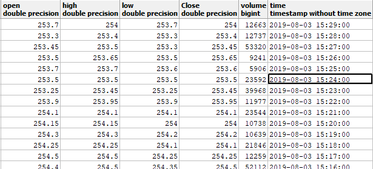

# INSIGHT INTO PROPOSAL AND IMPLEMENTATION

### Proposal

The idea is to capture 1-minute ticker data from NSE and mining it. Then the data is fed to the LSTM network to generate an intraday trend.

### Implementation

**Identification of data source for NSE Stock markets:**

Getting hold of NSE 1-minute historical data is an expensive affair as NSE sells the data at a premium price. So, the tool leverages alphavantage platform to obtain 1-min ticker data of a specific stock. For the sake of implementation, bank stocks data is collected on a timely basis for the month of February.

The stocks under consideration are CANBK (Canara Bank), AXISBANK (Axis Bank), SBIN(State Bank of India), BANKBARODA(Bank of Baroda), ICICIBANK(ICICI Bank), [HDFCBANK](https://www.bseindia.com/stock-share-price/hdfc-bank-ltd/hdfcbank/500180/)(HDFC Bank), [INDUSINDBK](https://www.bseindia.com/stock-share-price/indusind-bank-ltd/indusindbk/532187/)(Indus Ind Bank), [PNB](https://www.bseindia.com/stock-share-price/punjab-national-bank/pnb/532461/)( Punjab National Bank), [YESBANK](https://www.bseindia.com/stock-share-price/yes-bank-ltd/yesbank/532648/) (YES Bank), [FEDERALBNK](https://www.bseindia.com/stock-share-price/federal-bank-ltd/federalbnk/500469/) (Federal bank)

**Data collection from the source and necessary storage:**

Data is fetched from Alphavantage in JSON format. Attached is the JSON file. The collected data is loaded into a PostgreSQL. Sample Snapshot of Canara Bank after cleaning for a duration of 1st week of March is attached from the database.



**Cleaning of data**

By leveraging the DBScan technique, the data is cleaned in the initial stage. By using K-means, outliers are smoothed to adjust to normal range and obtain a smooth data curve. The timestamps are converted from EST to IST. Finally, the junk data is deleted and sudden peaks and valleys are replaced by their exponentially moving average for last 60 minutes

**Fig-4.1 Snapshot of data loaded in Database**

**Analysis of significant factors that contribute to prediction Accuracy**

It was learnt that in spite of having several features that determine the trade state of a stock, three factors namely Open Price, close price and volume are the most significant among them. Open price and close price will help in determining the average unit price of the stock and in this case it’s one minute.

Analyzing the volume trends provides gainful insights and with the intraday patterns would help determine when the trader can enter a particular stock and when the trader can exit to maximum profit with the same investment.

**Computing utility indicators using Data mining techniques**

Upon analyzing the patterns for Intraday trading using clustering of weighted averages, it was observed that accurate signal of SELL or BUY can be decided by analyzing the first 20 minutes of trade data. The performance of the stock for the entire day can be determined with the first 20 minutes performance.

It was also observed that if a stock trades above the exponential weighted moving average of that stock, then it is likely to trade in positive trend indicating a BUY signal prediction. Similarly if a stock opens below the exponential weighted moving average of that stock, it is likely that a negative trend is present and a SELL signal is generated.

The range of stock fluctuation for the day, entry and exits are not clearly specified by the 20-minute ticker data. Few algorithms have been used to determine the same. Determining the intraday trading patterns can be done by analyzing previous day trade patterns.

**Effective Indicator utilization for prediction**

There are several indicators in the current day trade for extracting inferences and generating stock predictions.

Some of the indicators leveraged are Moving Average, Exponential Moving average, Fibonacci zone, pitch form indicator, trend line generator and so on and so forth. But, not all of them are useful and accurate in predicting the intraday trend, or analyzing and adjusting based on sudden fluctuations during the trade.

Hence proposing a new indicator that would memorize the stock trading pattern, fit accordingly and adjust accordingly to predict the ups and downs of a particular stock.

**Applying machine Learning techniques to assess Indicator strength**

The indicator for the trade is the volume weighted average of the stock traded for the first 20 minutes of the trade day. That indicator is extrapolated based on trend pattern of that particular stock. The Root Mean Square Error is computed and the LSTM process is reiterated along with the current predicted data post adjusting to minimize RMS to enhance model accuracy.

**Leveraging NLP to understand market movement and trade emotions**

Market sentiments and trader emotions are one of the key indicators in determining the price of the stock. But the key aspect which technical analysts fail to understand and analyze is that market and thereby trade is driven by emotions and sentiments. Understanding market sentiments is a cup of tea for fundamental analysts, however, they fail to predict actual values.

Hence, popular finance websites like moneycontrol and platforms like facebook page of CNBC, moneycontrol which impact trades and stock are crawled using web crawlers like scapy, mechanize and the traders’ comments and reactions are captured. They are pre-processed and classified whether they are positive or negative. Accordingly, the signal can be predicted if the market is positive towards a particular stock.

**Prediction of calls (buy/sell)**

Initially, data is collected and stored in the database. It is cleaned, by removing outliers that are insignificant enough to not run into losses. Once that is complete, the data is processed to ensure compliance with the first 20-minute trade logic. The next step is to predict and give a signal: BUY or SELL. Based on the call for that particular day, extrapolating the data to generate current day’s trend is done. In Parallel, websites such as moneyControl.com are continuously checked for any news related to that stock. Any news found is subjected to classification, to check if it impacts trading, if yes, in what way. If there is no significant impact, the traders are confidently advised to proceed with trading. In case of adverse situations, there is a warning indicator that alerts the traders well before the transaction is done, by providing the risk indicator. Basing on the above process, the intraday trades are predicted for a particular stock.

### Results

The above process is implemented, in different standalone modules starting from collecting Data, cleaning it, processing and storing in the database. Intraday stock trends are predicted for Canara bank (CANBK) stock.

.png>)

**Fig 4.2 Data Feed for the prediction Module**

The results are captured and compared with actual trade data, for high, low, open and close values.

| low    | prediction | Error   |
| ------ | ---------- | ------- |
| 262.55 | 262.4817   | 0.0683  |
| 263.7  | 263.7651   | 0.06514 |
| 264.4  | 264.4662   | 0.0662  |
| 266.4  | 266.5636   | 0.16363 |
| 269.2  | 269.1317   | 0.06832 |
| 270.05 | 270.2192   | 0.16918 |
| 270.55 | 270.4787   | 0.07133 |
| 270.9  | 270.7301   | 0.16987 |
| 270.9  | 270.9662   | 0.0662  |
| 271.4  | 271.223    | 0.17698 |
| 271.3  | 271.3622   | 0.06218 |
| 271.65 | 271.4739   | 0.17606 |
| 271.7  | 271.5326   | 0.16738 |
| 271.8  | 271.6214   | 0.17863 |
| 271.7  | 271.6327   | 0.06728 |
| low    | prediction | Error   |
| 272.1  | 271.9316   | 0.16836 |
| 272.15 | 271.9792   | 0.17078 |
| 272.2  | 272.1377   | 0.06227 |
| 272.35 | 272.2831   | 0.06695 |
| 272.45 | 272.3794   | 0.0706  |
| 272.55 | 272.4802   | 0.06978 |
| 272.7  | 272.6383   | 0.0617  |
| 272.9  | 272.7309   | 0.1691  |
| 272.9  | 272.837    | 0.063   |
| 272.95 | 272.8799   | 0.0701  |
| 273    | 272.9326   | 0.0674  |
| 273.2  | 273.1321   | 0.06795 |
| 273.65 | 273.475    | 0.17502 |
| 273.75 | 273.5692   | 0.18085 |
| 273.8  | 273.6263   | 0.1737  |

**Table 4.1 Actual Vs Predicted Values for CANBK**

.png>)

**Fig 4.3 High Price Prediction result**

Orange color plot is for the predicted data, green the actual data and blue is the feed data. The time frame for feed data is a duration of one week. The above data feed helped prediction of following values

.png>)

**Fig 4.4 Low Price Prediction result**
